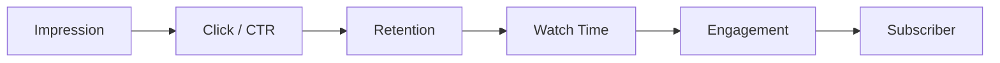

# YouTube Acquisition & Engagement Modeling

**Product analytics on 30K+ videos — mapping the viewer funnel from impression to subscriber.**

[](report.pdf)

---

## Project Overview

This project analyzes video-level YouTube performance data to understand what actually drives channel performance. Instead of looking only at views or subscribers, it follows the full **viewer journey**:

1. A viewer sees a video impression.
2. The viewer may click the video.
3. The viewer may continue watching or leave early.
4. The viewer may interact through likes, comments, or shares.
5. The viewer may become a subscriber.

The core product question:

> Do YouTube videos grow because they get **discovered**, because viewers **stay engaged**, or because viewers **actively interact** with the content?

The analysis uses R, R Markdown, statistical modeling, and visual reporting to study relationships among impressions, click-through rate, retention, engagement, watch time, and subscribers gained.

---

## Why This Project Matters (PM Lens)

YouTube creators and growth teams often optimize for **surface metrics** — views, impressions, CTR. Those numbers are easy to track but do not always explain sustainable growth.

This project reframes performance around three product concepts:

| Stage | Question | Metric proxy |
|-------|----------|--------------|
| **Discovery** | How many people see the video? | Impressions, CTR, traffic source |
| **Content depth** | Do viewers stay once they click? | Average % viewed, watch time |
| **Active engagement** | Do viewers interact with the content? | Weighted likes / comments / shares |

**Product takeaway:** Treat the funnel as separate decision layers. Optimizing reach alone does not guarantee engagement or conversion — and subscriber growth may require richer signals than video-level metrics alone.

---

## Dataset

**File:** `YouTube_Video.csv`

~30,000 YouTube video records over a 365-day window. Each row is one video with funnel metrics including:

- Upload date, video duration, content category, traffic source
- Impressions, CTR, average view duration, average view percentage
- Likes, comments, shares, total watch time
- Subscribers gained

---

## Research Questions

The project is organized around four hypotheses across the viewer lifecycle:

| # | Question | Product decision it informs |
|---|----------|----------------------------|
| **RQ1** | Do impressions and CTR predict active engagement? | Should growth teams invest in reach vs. interaction quality? |
| **RQ2** | Is retention more useful than CTR for subscriber growth? | Thumbnail optimization vs. content quality prioritization |
| **RQ3** | Which factors best explain total watch time? | What drives volume once a video is exposed? |
| **RQ4** | Does engagement explain subscriber growth beyond watch time? | Passive viewing vs. active interaction as conversion signals |

---

## Methods

| Layer | Approach |
|-------|----------|
| **Preprocessing** | Log-10 transforms for volume metrics; z-score standardization for comparable coefficients |
| **Feature engineering** | Weighted engagement score (see below) to reduce multicollinearity |
| **Validation** | 80/20 train-test split; 10-fold cross-validation; holdout RMSE / MAE / R² |
| **Inference** | OLS regression for interpretable, stakeholder-ready coefficients |
| **Robustness** | VIF diagnostics; Random Forest benchmark for nonlinear effects |

**Weighted engagement score:**

```r
weighted_engagement = (1 * likes) + (3 * comments) + (4 * shares)
```

Likes = low-effort signal · Comments = active interest · Shares = strongest endorsement

---

## Key Findings & Product Implications

| Finding | Implication for creators / growth teams |
|---------|----------------------------------------|
| **Watch time is the strongest modeled outcome** | Impressions and duration explain meaningful watch-time behavior — exposure still matters for volume |
| **Discovery ≠ engagement** | More impressions and higher CTR do **not** automatically produce stronger active engagement |
| **Engagement adds value beyond passive watch time** | Active interaction explains incremental subscriber variance beyond watch time alone (in-sample) |
| **Subscriber growth is hard to predict at video level** | Holdout R² near zero — current features are insufficient for reliable conversion forecasting |

**What to prioritize today:** Retention and active engagement over vanity reach metrics.

**What to build next:** Early-window metrics (24h/48h), channel history, upload timing, audience segments, and content metadata to improve subscriber prediction.

---

## Workflow

```text
Dataset → Cleaning → Feature Engineering → Modeling → Evaluation → Report
```



---

## Project Files

| File | Description |
|------|-------------|
| `README.md` | Project overview and PM-oriented summary |
| `YouTube_Video.csv` | Main dataset (~30K video records) |
| `analysis.Rmd` | Reproducible analysis — preprocessing, modeling, tables, visuals |
| `report.pdf` | Final written report with full findings and interpretation |

---

## How to Run

Open R or RStudio in the project root:

```r
install.packages(c("dplyr", "ggplot2", "gridExtra", "knitr", "scales", "car", "randomForest"))
rmarkdown::render("analysis.Rmd")
```

Rendering produces HTML/Word output locally. The committed PDF report is available without re-running the analysis.

---

## Tech Stack

- **Language:** R
- **Packages:** `dplyr`, `ggplot2`, `gridExtra`, `knitr`, `scales`, `car`, `randomForest`
- **Output:** R Markdown → HTML / Word / PDF

---

## Repository Structure

```text
.
├── README.md
├── LICENSE
├── YouTube_Video.csv
├── analysis.Rmd
└── report.pdf
```

---

## Future Roadmap

Product and modeling improvements for v2:

- First 24h / 48h performance metrics (early signal detection)
- Channel-level historical baselines and cohort comparisons
- Upload day / time and content metadata features
- Thumbnail and title experimentation data
- Audience segment breakdowns
- Category-specific models (Gaming vs. Education vs. News)
- Boosted tree models (XGBoost / LightGBM) for nonlinear growth patterns

---

## Summary

YouTube performance is not one metric — it is a **funnel**. Discovery, retention, engagement, watch time, and subscriber growth behave differently and should be measured, prioritized, and optimized separately.

This project is useful for anyone working on **creator growth strategy**, **product metrics design**, **statistical decision-making**, or **data storytelling with R**.

---

## License

MIT — see [LICENSE](LICENSE).
